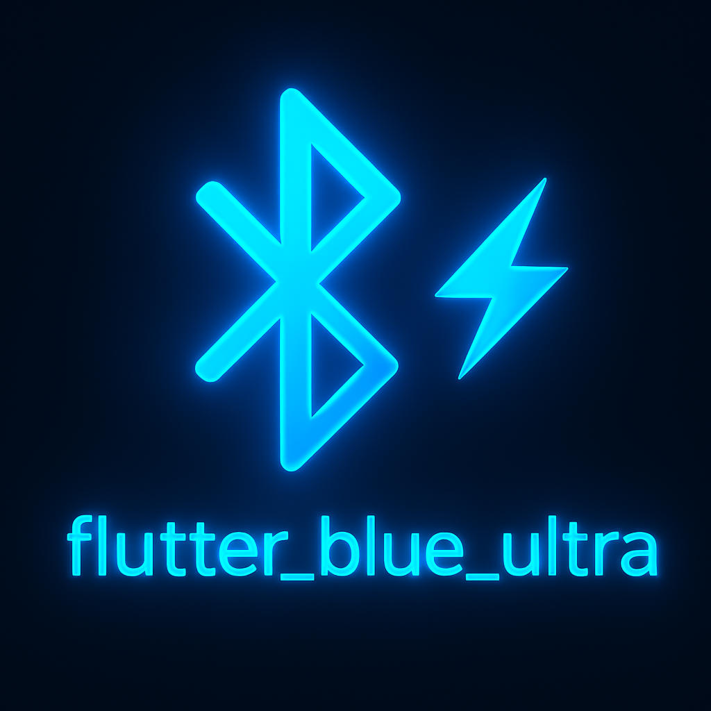

<p align="center">
  
</p>

### Flutter Blue Ultra

An open-source, free to use Bluetooth Low Energy (BLE) plugin for Flutter. Flutter Blue Ultra continues support and maintenance for the legacy 1.x API of `flutter_blue_plus`, providing a stable alternative for apps that rely on that series while keeping the project community-driven.

### Why Flutter Blue Ultra?
- **Legacy 1.x compatibility**: keep using the well-known `flutter_blue_plus` 1.x API surface.
- **Cross‑platform**: iOS, Android, macOS, Linux, and Web (central role).
- **Open and free**: community-first, no sponsorship section, transparent roadmap via issues/PRs.

### Quick start
1) Add the package in your app (temporary path or git until pub release):
```yaml
dependencies:
  flutter_blue_ultra:
    git:
      url: https://github.com/intent-dev/flutter_blue_ultra.git
```

2) Minimal usage example:
```dart
import 'package:flutter_blue_plus/flutter_blue_plus.dart';

void main() async {
  // Ensure bluetooth supported and on before scanning
  if (await FlutterBluePlus.isSupported == false) return;
  await FlutterBluePlus.adapterState
      .where((s) => s == BluetoothAdapterState.on)
      .first;

  // Scan briefly
  await FlutterBluePlus.startScan(timeout: const Duration(seconds: 5));
  await FlutterBluePlus.isScanning
      .where((v) => v == false)
      .first;
}
```

### Documentation
- Getting started: `docs/getting_started.md`
- Usage & code samples: `docs/usage.md`
- Background behavior: `docs/background.md`
- API reference: `docs/api_reference.md`
- Common problems: `docs/common_problems.md`
- Versioning: `docs/versioning.md`

### Migrating from flutter_blue_plus
- If you are on `flutter_blue_plus` 1.x, this project is a drop‑in alternative focused on keeping that API alive and maintained.
- For original migration notes between FlutterBlue and Flutter Blue Plus, see the 1.x guide here:
  - `packages/flutter_blue_plus/MIGRATION.md`

### Credits and origins
- This project is a community continuation of `flutter_blue_plus` 1.x.
- Original work: `flutter_blue_plus` (`https://github.com/boskokg/flutter_blue_plus`) and `flutter_blue` (`https://github.com/pauldemarco/flutter_blue`).

### License
Licensed under the BSD 3‑Clause license. See `LICENSE`.


